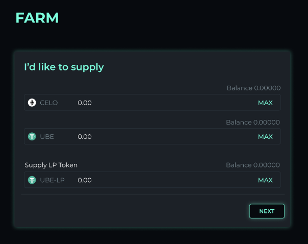

# Opening a farm position

## There are four steps to opening a farming position.

1\) Select a pool

2️\) Supply liquidity

3️\) Select leverage

4️\) Confirm strategy

## 1\) Select a pool

Dahlia V1 will enable leveraged yield farming of liquidity pools that are on **Ubeswap, Mobius, Symmetric, and Sushiswap** initially. Then once **Curve** and **Saddle** go live, those too! Users can select any of the aforementioned pools on Dashboard page.

For instance, if “Ubeswap's UBE-CELO pool” is selected, the transaction will be executed on the UBE-CELO pool on Ubeswap.

