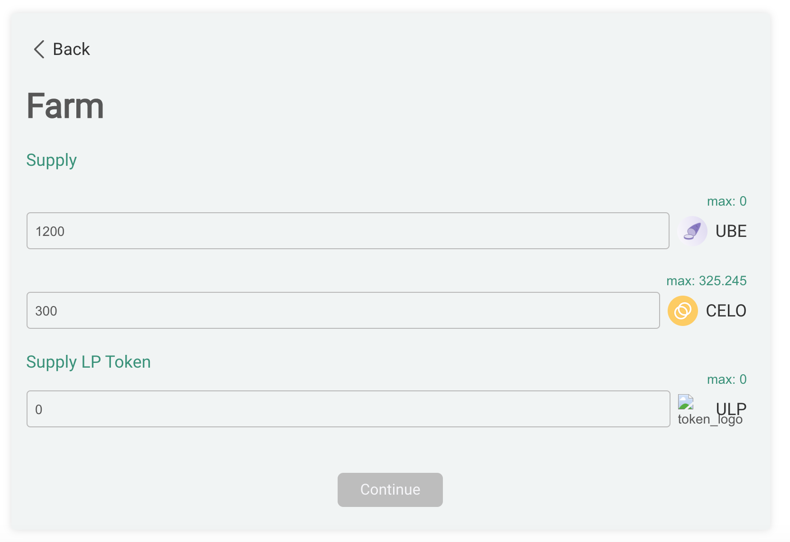

# Opening a farm position

## There are four steps to opening a farming position.

(1) Select a farming pool

(2) Supply liquidity

(3) Select leverage amount with toggle

(4) Confirm strategy

That's it!

## 1) Select a pool

Dahlia initially will enable leveraged yield farming of liquidity pools that are on **Ubeswap**. We will quickly look to allow for leveraged farming on every opportunity on Celo! Users can select any of the aforementioned pools on Dashboard page.

For instance, if “Ubeswap's UBE-CELO pool” is selected, the transaction will be executed on the UBE-CELO pool on Ubeswap.

.png>)

## 2) Supply Liquidity

Enter the amount willing to supply to farming. This is the collateral for the leveraged position. As the picture indicated, a user can press the green "max" button an enter the full amount, or manually add a desired number. Please note, in order to continue, a user must supply a similar amount in value of each token in order to continue.  

## 3) Set the amount of leverage

The toggle below the the assets will allow you to the set the amount leverage you want. In other words, the amount you want to borrow on your assets. Be aware, the debt ratio is factored into this.  More about that in the "managing leverage" section.

.png>)

## 4) Look over position breakdown

Once you have set the amount for each asset, you will be directed to a position breakdown to tab that confirms the amount of assets supplied and borrowed for each.

## 5) Just approve, and your set!

